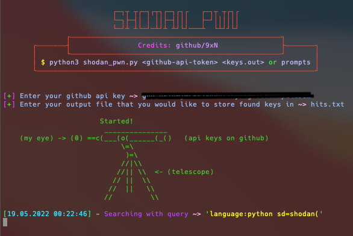

# shodan_pwn

The only tool you'll ever need for free and easy internet reconnaissance!

## Setup:

1. Install python3.9 from https://www.python.org/
2. Clone or download this repository 
3. `$ cd` to the directory that you cloned or downloaded this repository to
4. Add search queries and dorks to the appropirate text files in the `dorks/` directory
5. Sign in to github and click on your profile in the top right > settings > developper settings (at the very bottom) > personal access tokens > tokens classic > generate new token > generate token > copy and paste this token into shodan_pwn when prompted (feel free to save it in a SAFE location for future use)
6. Run `$ python3 shodan_pwn.py` and follow prompts! (Bonus points if you add an alias to run this command using shortcuts in your terminal!)
7. Profit!

### TODO:

- Add better more clear error messages when; importing modules, handling empty dork file cases, invalid github keys
- Add config system to save github key and key output storage file
- Create key output storage file if given parameter for a "preexisting" one does not actually preexist

## Example usage:

